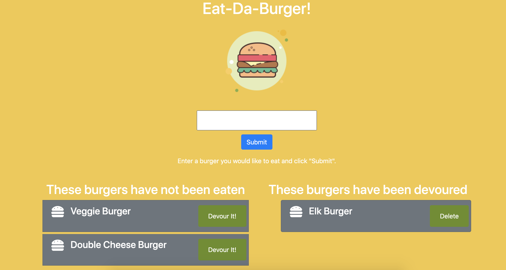

# EatDaBurger
A simple MVC application built with mysql, node, express and handmade orm. 

## Deployment 
https://arcane-thicket-88504.herokuapp.com/

## Installation
This application uses 4 npm packages. Please run an npm i prior to running the application locally. Also in the db/ folder, there is a schema and seeds.sql files that need to be run in your local sql server to have the database interaction. Then type node server.js into your command prompt to start the application.

## Screenshot

## Usage
This application allows you to create a wish list for burgers that you want to try, you can put it on the list and once you devoured the burger, the burger will remove from the list.

## To do
Finally fixed the update function.
